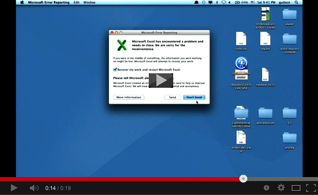

=== FRUIT -- Framework for Robust User Interface Testing ===

FRUIT is a library that allows testing complex applications through their Graphical User Interface (GUI). It uses
the Operating System's Accessibility API to gather the state of an application and can automatically derive sensible
actions from this state. This allows to test an application fully automatic (no scripting). The general idea is to find critical
faults such as crashes and freezes and save them for later inspection.

This is a video of fruit in action:

More videos and screenshots of FRUIT can be found at https://staq.dsic.upv.es/sbauersfeld/index.html

contact: Sebastian Bauersfeld (sebastianbauersfeld AT gmx DOT de)
